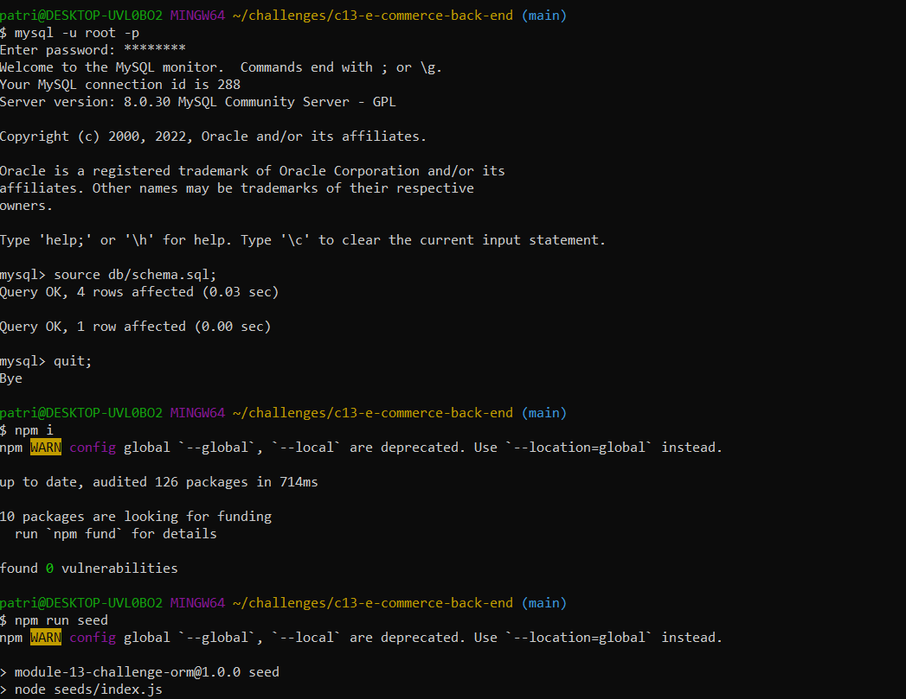

# c13-e-commerce-back-end

## Table of Contents

[Description](#description)

[Installation Instructions](#installation)

[Usage Instructions](#usage)

[License](#license)

[Github](#github)

## Description

ecommerce back end using sequilize to interact with a mysql database

accessible through Github

https://github.com/patrickthegu/c13-e-commerce-back-end

## Installation Instructions

- Download from Github

- navigate to directory from command line

- run mysql -u root -p

- run source db/schema.sql

- run npm install

- run npm run seed

- connect via http://localhost:3001

## Usage Instructions

Refer to video

[Screenrecording](./screenrecording.mp4)

## License

[Apache License 2.0](https://opensource.org/licenses/Apache-2.0)

## Github

[patrickthegu](https://github.com/patrickthegu)

